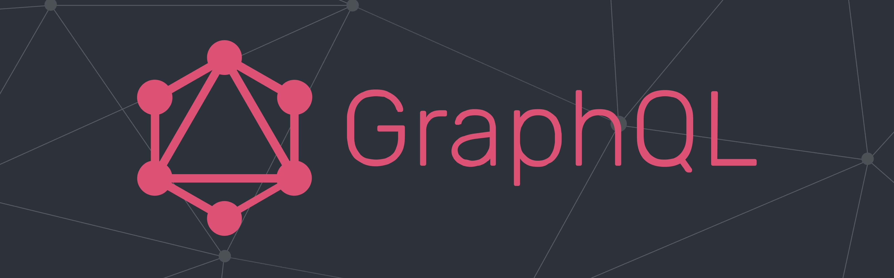

<p align="center">
  
</p>

# Getting Started with Learning Graph QL

### **What is Graph QL?**
<sup>
GraphQL is a query language and server-side runtime for application programming interfaces (APIs) that prioritizes giving clients exactly the data they request and no more. 
</sup>

---

### **Why to use Graph QL?**
Suppose you have two tables in your database
1. Feed
2. User

>Feed Array
```json
"feed": [
  {
    "id": 1,
    "full_name": "Ainslee Giffard",
    "user_name": "agiffard0",
    "user_avatar": "https://robohash.org/architectoetveniam.png",
    "image_url": "http://dummyimage.com/234x245.png",
    "likes": [{ "id": 107 }, { "id": 20 }, { "id": 79 }, { "id": 159 }],
  },
  .
  .
  .
]
```

>User Array
```json
"users": [
  {
    "user_id": 1,
    "full_name": "Ankit Dhawan",
    "user_name": "adhawan",
    "user_avatar": "https://robohash.org/sapienteplaceatet.png",
  },
  .
  .
  .
]
```

<sup>
If you want only the names of the users who liked the post then your REST API will be give you tons of useless data that you might not need. Thus taking more time and more server load.Whereas in Graph QL you can only get data that you require, filtering all the data in the backend.
</sup>

<br></br>

#### **How to request data in Graph QL**
>Query
```
query {
  getFeed {
    likes {
      id
    }
  }
}
```

>Output 👇🏻
```json
{
  "data": {
    "getFeed": [
      {
        "likes": [
          {"id":107},{"id":20},{"id":79},{"id":159}
        ]
      }
    ]
  }
}
```
<br></br>
>Query
```
query {
  getUser(id: 107) {
    full_name
    user_name
  }
}
```
>Output 👇🏻
```json
{
  "data": {
    "getUser": [
      {
        "full_name": "Ankit Dhawan",
        "useranme": "adhawan"
      }
    ]
  }
}
```

---

### **How I secured my Graph QL API**
### **Graph QL Shield**
GraphQL Shield provides a straightforward approach to writing permissions in GraphQL servers. Its primary focus is abstracting permission layer efficiently from the logic layer of our server. Nevertheless, its raw power comes with dynamic caching which significantly reduces server load and accounts for faster query evaluation.
<br></br>
You can read more about **GraphQL Shield** [here](https://www.the-guild.dev/graphql/shield/docs)

---

### **How I secured user data**
### **Bcrypt**
bcrypt is a password hashing function which uses a 128-bit salt and encrypts a 192-bit magic value. It takes advantage of the expensive key setup in eksblowfish.
<br></br>
You can read more about **Bcrypt** [here](https://github.com/kelektiv/node.bcrypt.js)

---

### **Languages supported by Graph QL**

<code>  </code>
<code>  </code>
<code>  </code>
<code>  </code>
<code>  </code>
<code>  </code>
<code>  </code>
<code>  </code>
<code>  </code>
<code>  </code>
<code>  </code>
<code>  </code>
<code>  </code>
<code>  </code>
<code>  </code>
<code>  </code>
<code>  </code>
<code>  </code>
<code>  </code>
<code>  </code>
<code>  </code>
<code>  </code>
<code>  </code>
<code>  </code>
<code>  </code>
<code>  </code>

---

| Command | Description |
| --- | --- |
| `git clone` | Clone an existing repo to your device |
| `npm install` | Install all the required dependencies for project |
| `npm start` | Run the project |
| `npm run devStart` | Run the project with nodemon |

---

### **Dependencies used**
- express-graphql
- express
- graphql
- nodemon (optional)
- graphql-shield
- graphql-middleware
- bcrypt

---

You can know more about **Graph QL** [here](https://graphql.org/)
<br></br>
Check out Graph QL Express Documentation [here](https://graphql.org/graphql-js/running-an-express-graphql-server/)

