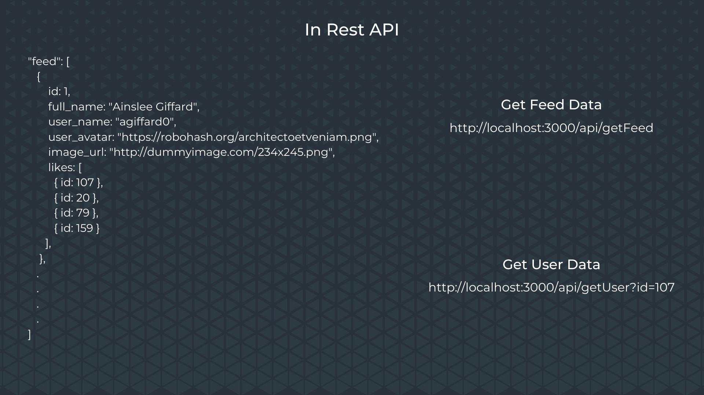
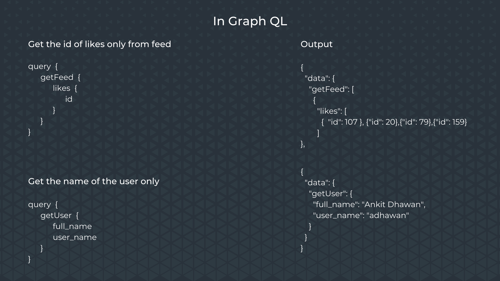

  

# Getting Started with Learning Graph QL

### **What is Graph QL?**
GraphQL is a query language and server-side runtime for application programming interfaces (APIs) that prioritizes giving clients exactly the data they request and no more. 

---

### **Why to use Graph QL?**
Suppose you have an array of objects with posts and you want to obtain only the names of the person who liked the post.

  

In REST API, you'll need to get all the unwanted data of the post that you might not need in a istuation. Thus, making the server take more load and compromising the response time.
  
Whereas in Graph QL, you can only get the values you require, filtering all the data in the backend. 

  

---
### **Languages supported by Graph QL**

<code>  </code>
<code>  </code>
<code>  </code>
<code>  </code>
<code>  </code>
<code>  </code>
<code>  </code>
<code>  </code>
<code>  </code>
<code>  </code>
<code>  </code>
<code>  </code>
<code>  </code>
<code>  </code>
<code>  </code>
<code>  </code>
<code>  </code>
<code>  </code>
<code>  </code>
<code>  </code>
<code>  </code>
<code>  </code>
<code>  </code>
<code>  </code>
<code>  </code>
<code>  </code>

### **Dependencies used**
- express-graphql
- express
- graphql
- nodemon (optional)

---

You can know more about **Graph QL** [here](https://graphql.org/)
  
Check out Graph QL Express Documentation [here](https://graphql.org/graphql-js/running-an-express-graphql-server/)

